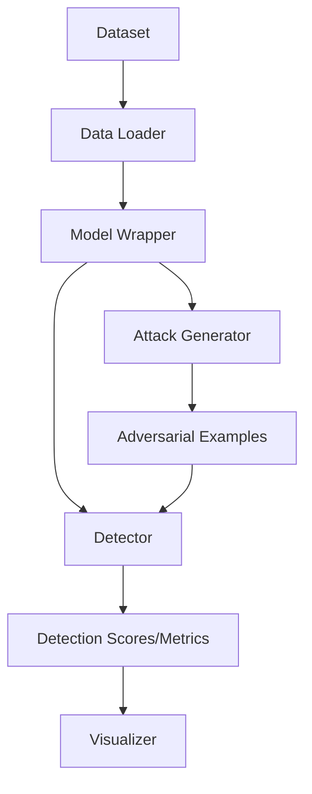

# Refactoring Plan - Adversarial Attack Detection Research

## 1. Objectives
- Unify MNIST/CIFAR/SVHN and Toy dataset pipelines.
- Clean up code duplication.
- Improve extensibility for new models, datasets, and detectors.
- Organize the project into a logical folder structure.

## 2. Proposed Structure
```
/
├── core/
│   ├── __init__.py
│   ├── data_loaders.py      # Unified data loading
│   ├── models.py            # Model wrappers and feature extraction
│   ├── attacks.py           # Unified attack implementations
│   ├── detectors.py         # LID, KD, KM, TDA implementations
│   └── utils.py             # Math and helper utilities
├── experiments/
│   ├── run_mnist.py         # MNIST experiment script
│   └── run_toy.py           # Toy dataset experiment script
├── visualizer/              # (Existing) Visualization tools
├── data/                    # Data storage
├── models/                  # Saved model weights
└── results/                 # Experiment results
```

## 3. Key Components

### 3.1 `core/models.py`
- `ModelWrapper`: A class that wraps any PyTorch model and provides:
    - `get_logits(x)`
    - `get_features(x)`: Returns activations from all relevant layers.
    - `predict(x)`: Returns class labels.
- Factory function `get_model(dataset_name, path)` to load specific models.

### 3.2 `core/data_loaders.py`
- Unified `get_dataloader(dataset_name, batch_size, ...)` function.
- Support for MNIST, CIFAR, SVHN, and Toy (Circle/Gaussian).

### 3.3 `core/attacks.py`
- `BaseAttack` abstract class.
- Implementations: `FGSM`, `BIM` (with first/last modes), `JSMA`, `CWL2`, `CWLID`.
- Attacks should handle both binary and multi-class models by checking `model.is_binary`.

### 3.4 `core/detectors.py`
- `BaseDetector` abstract class with `fit()` and `detect()` methods.
- `LIDDetector`, `KDDetector`, `KMDetector`, `TDADetector`.

## 4. Workflow
1. **Setup**: Create the `core` directory and `__init__.py`.
2. **Utilities**: Implement `core/utils.py` with consolidated math functions.
3. **Data & Models**: Implement `core/data_loaders.py` and `core/models.py`.
4. **Attacks**: Implement `core/attacks.py` by consolidating existing logic.
5. **Detectors**: Implement `core/detectors.py` using the unified `ModelWrapper`.
6. **Experiments**: Create scripts in `experiments/` to replicate current functionality.
7. **Verification**: Run experiments and compare results with the original codebase.
8. **Cleanup**: Move old files to `.old/`.

## 5. Mermaid Diagram of Unified Workflow



Does this plan look good to you? If so, I will switch to Code mode to start the implementation.
