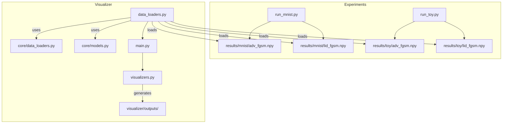

# Visualizer Refactoring Plan

## 1. Objectives
- Adapt `visualizer` to the new `core` and `experiments` structure.
- Remove dependency on old `util.py`.
- Support multiple datasets (MNIST, Toy, CIFAR, SVHN).
- Fix data loading paths and naming conventions.
- Improve TDA visualization to match new detector output.

## 2. Proposed Changes

### 2.1 `visualizer/config.py`
- Update `DATA_DIR` to point to `data/` (for models).
- Add `RESULTS_DIR = BASE_DIR / "results"`.
- Update `FILE_PATTERNS` to match experiment outputs:
    - `adversarial`: `adv_{attack}.npy`
    - `characteristics`: `{char}_{attack}.npy`
- Update `get_data_file_path` to route to `results/{dataset}/` for non-model files.
- Add configurations for `toy`, `cifar`, and `svhn`.

### 2.2 `visualizer/data_loaders.py`
- Replace `util` imports with `core.data_loaders` and `core.models`.
- Refactor `load_original_data` to use `core.data_loaders.get_dataloader`.
- Refactor `load_model_predictions` to use `core.models.get_model` and `ModelWrapper`.
- Update `load_characteristics_data` to handle the `[features, label]` format saved by experiments.
- Update `check_required_files` to look in the correct `results/` subdirectories.

### 2.3 `experiments/run_mnist.py` & `experiments/run_toy.py`
- Add `np.save` for adversarial examples (`X_adv`) to allow visualization.
- Ensure consistent naming: `adv_{attack}.npy`.

### 2.4 `visualizer/visualizers.py`
- **General**: Use `self.config` for image shapes and number of classes.
- **AdversarialVisualizer**: 
    - Add `create_toy_visualization` for 2D scatter plots.
    - Update `create_image_grid_comparison` to handle different image shapes.
- **DetectionVisualizer**:
    - Ensure it works with the combined `[features, label]` format.
- **TDAVisualizer**:
    - Adapt to the new TDA output format (currently just features).
    - *Optional*: Update `core/detectors.py` to return diagrams for better visualization.

### 2.5 `core/detectors.py` (Optional but recommended)
- Update `TDADetector.detect()` to return a dictionary containing both `features` and `dgms` (persistence diagrams) to restore `TDAVisualizer` functionality.

## 3. Implementation Steps
1.  **Config & Data Loaders**: Update `config.py` and `data_loaders.py` first as they are the foundation.
2.  **Experiment Scripts**: Update `run_mnist.py` and `run_toy.py` to save `X_adv`.
3.  **Visualizers**: Refactor `visualizers.py` to use the new data and support multiple datasets.
4.  **Verification**: Run `visualizer/main.py` with various modes and datasets.

## 4. Mermaid Diagram of Data Flow

